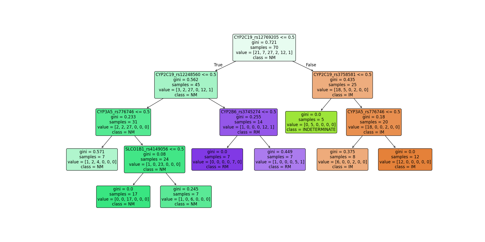
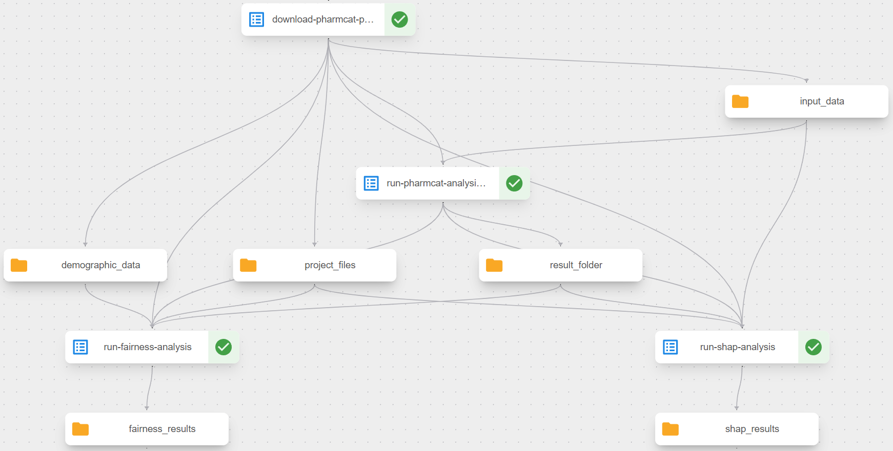

## Pharmacogenomics (PGx) Analysis with Explainability

This project provides explainable AI tools for analyzing pharmacogenomic phenotype predictions made by PharmCAT.
It uses multiple explanation methods (SHAP, LIME, and perturbation-based analysis) with a fuzzy logic system to explain which genetic variants contribute to phenotype predictions and includes a fairness analyzer to detect potential biases across demographic groups.

## Project Overview

PharmCAT is a software tool that analyzes genetic data (VCF files) to predict pharmacogenomic phenotypes that influence drug metabolism and response.
This project adds an explainability layer to understand why PharmCAT makes specific predictions and to identify potential biases in those predictions

Key components:
1. Converting VCF genetic data to analyzable csv format.
2. Providing explainability for PharmCAT predictions using a blend of SHAP, LIME, and perturbation-based analysis.
3. Analyzing potential demographic bias and fairness issues in predictions.

The project focuses on the key pharmacogenes: **CYP2B6, CYP2C9, CYP2C19, CYP3A5, SLCO1B1, TPMT, and DPYD.**

## Getting Started
### Prerequisites

- Python 3.10
- Docker (for running PharmCAT)
- Required Python packages (install via `pip install -r requirements.txt`)

### Execution Steps
1. **Download Dataset:** Download the provided dataset from [here](https://maastrichtuniversity.sharepoint.com/:f:/r/sites/FSE-REALM/Shared%20Documents/WP6/Open_Source_Datasets_per_UC/UC2_PGx2P_VITO/Data/V2?csf=1&web=1&e=1ReQnp).
2. **Download PharmCAT Docker Components:** Download the necessary tools and scripts from [here](https://maastrichtuniversity.sharepoint.com/:u:/r/sites/FSE-REALM/Shared%20Documents/WP6/Open_Source_Datasets_per_UC/UC2_PGx2P_VITO/Data/V2/Software/pharmcat-realm.zip?csf=1&web=1&e=NQFgXx)
3. **Setup Execution Environment:**
   1. Create a folder called `pharmcat_execution` and unzip all files downloaded from step 2. into it. 
   2. Inside the `data` folder, place all `.vcf` files downloaded from step 1.
4. Navigate inside the `pharmcat_execution` directory and execute: `docker build -t pharmcat-realm .`
5. _(WINDOWS)_ Execute: `docker run -v <absolute_path_to_data_folder>:/data -v <absolute_path_to_result_folder>:/result pharmcat-realm --input_folder /data --result_folder /result`. (e.g. `docker run -v C:/Users/gigak/Desktop/realm_uc2_vito_image/data/:/data -v C:/Users/gigak/Desktop/realm_uc2_vito_image/result/:/result pharmcat-realm --input_folder /data --result_folder /result`).
This will execute the pharmcat pipeline for all samples placed in the `data` folder. The `result` folder will contain `phenotype.json` files for each sample and a total `phenotypes.csv` file containing the output in the format:

| Sample ID | CYP2B6 | CYP2C19 | CYP2C9 | CYP3A5 | DPYD | SLCO1B1 |     TPMT      |
|:---------:|:------:|:-------:|:------:|:------:|:----:|:-------:|:-------------:|
|  HG00276  |   RM   |   NM    |   IM   |   PM   |  NM  |   DF    | INDETERMINATE |
|  HG00436  |   IM   |   NM    |   NM   |   PM   |  NM  |   NF    |      NM       |

6. Place the `result` folder in the root of the current project.
7. Execute the `pgx_analyzer.py` script to explain PharmCAT predictions: `python pgx_analyzer.py --input_dir <path_to_vcf_files> --phenotypes_file result/phenotypes.csv --output_dir pgx_results --convert_vcf --sensitivity 0.7`. 
   1. The `sensitivity` parameter (0.0-1.0) controls the blend between explanation methods:
      1. Lower values (near 0.0): Faster but less precise perturbation-based analysis
      2. Medium values (around 0.5): Balanced approach using LIME and other methods
      3. Higher values (near 1.0): More precise but computationally intensive SHAP analysis
   2. The `max_samples` parameter limits how many samples receive detailed analysis (-1 for all samples)

    This will generate a `pgx_results.json` file with detailed explanations and a `pgx_summary.txt` file with a human-readable summary.
8. Execute the `pgx_fairness_analyzer.py` script: `python pgx_fairness_analyzer.py --demographic_file Demographics/pgx_cohort.csv --phenotypes_file result/phenotypes.csv --output_dir pgx_fairness_results`. This will generate individual fairness reports for each sample and an overall fairness report, highlighting any potential demographic bias in the predictions.
9. Examine the output files:
   1. `pgx_results/pgx_results.json`: Contains feature importance and sample-specific explanations
   2. `pgx_results/pgx_summary.txt`: Provides a human-readable summary of the SHAP analysis
   3. `pgx_fairness_results/overall_fairness_report.json`: Summarizes potential bias across demographic groups
   4. Individual sample reports in the respective output directories
10. _Alternative Pipeline Execution: Use the Kubeflow pipeline to automate the entire workflow: `python kubeflow_component/pgx_pipeline_component.py`. This will generate a `pharmcat_pipeline_.yaml` file that can be uploaded to a Kubeflow environment for execution. See more details in the [Kubeflow Pipeline Component](#kubeflow-pipeline-component) section. 

The `pgx_analyzer.py` script supports the following command-line arguments (can also be used in the Kubeflow pipeline):

- `--input_dir` (str, Required): Directory containing VCF or CSV files to analyze. The script will look for files here or in a "preprocessed" subdirectory.
- `--phenotypes_file` (str, Required): Path to the phenotypes.csv file generated by PharmCAT, containing the phenotype predictions to explain.
- `--output_dir` (str, default: `pgx_results`): Directory where analysis results will be saved. Will be created if it doesn't exist.
- `--convert_vcf` (bool, default: False): When specified, converts VCF files to CSV format for analysis. CSV files are saved in the "preprocessed" subdirectory of the output directory.
- `--max_samples` (int, default: -1): Maximum number of samples to use for detailed SHAP/LIME analysis. Set to -1 to analyze all available samples (may be slow for large datasets).
- `--sensitivity` (float, default: 0.7): Controls the balance between different explanation methods (value between 0.0-1.0): Lower values (near 0.0): Faster but less precise perturbation-based analysis. Medium values (around 0.5): Balanced approach using LIME and other methods. Higher values (near 1.0): More precise but computationally intensive SHAP analysis
- `--method` (str, default: None): Explicitly choose a single explanation method, overriding the sensitivity blend. Options: `shap`, `lime`, or `perturbation`
- `--run_counterfactual` (bool, default: False): When specified, performs counterfactual analysis to show how changing individual variants affects phenotype predictions.
- `--run_rule_extraction` (bool, default: False): When specified, extracts and visualizes decision rules using surrogate decision tree models, generating images like the decision tree visualization shown above.
- `--top_k` (int, default: 10): Number of top features to consider for counterfactual analysis. Limits the analysis to the most important variants.

E.G. For a perturbation based analysis with counterfactual and rule explanations run: `python pgx_analyzer.py --input_dir data/ --phenotypes_file result/phenotypes.csv --output_dir detailed_results --convert_vcf --sensitivity 0.8 --max_samples -1 --method perturbation--run_counterfactual --run_rule_extraction`

## Analyzer JSON Output

The output is organized into three main sections:

- `gene_explanations`
   
   This section contains model explanations for each gene (CYP2B6, CYP2C9, CYP2C19, CYP3A5, SLCO1B1, TPMT, DPYD). For each gene:
  - `prediction_distribution`: The count of different phenotype predictions across the analyzed samples:
    - PM (Poor Metabolizer)
    - IM (Intermediate Metabolizer)
    - NM (Normal Metabolizer)
    - RM (Rapid Metabolizer)
    - UM (Ultrarapid Metabolizer)
    - NF (Normal Function)
    - DF (Decreased Function)
    - PF (Poor Function)
    - IF (Increased Function)
    - INDETERMINATE (Uncertain phenotype)
  - `top_features_by_gene`: Organizes the most influential features by their source gene. For example, for CYP2B6, it shows which variants in DPYD, CYP2C19, CYP2C9, etc. had the greatest impact on CYP2B6 phenotype predictions. Each feature includes:
    - `feature`: The name of the genetic variant (format: `GENE_rsID_allele_type`)
    - `importance`: The average magnitude of impact this feature has across all samples
- `feature_importance`
   
   This provides a flattened view of global feature importance for each target gene. It lists the top 20 most important features that influence phenotype predictions for each gene, sorted by importance value.
- `sample_explanations`

   This contains specific explanations for individual samples, showing why particular phenotypes were predicted. For each sample-gene combination:
   - `sample_id` Identifier for the sample (e.g., **HG00276**)
   - `gene`: The gene being explained
   - `predicted_phenotype`: The predicted phenotype for this sample-gene pair
   - `top_contributions`: List of features that most influenced this prediction:
     - `feature`: Name of the genetic variant
     - `value`: The value of this feature for this sample (typically 0 or 1, where 1 means the variant is present)
     - `shap_value`: The SHAP value representing the impact on the prediction (positive values push toward the predicted phenotype, negative values push away)
   - `explanation`: A human-readable explanation of the prediction

### Feature Naming Conventions
Features in the output follow these patterns:
- `GENE_rsID`: Basic SNP identifier (e.g., "CYP2B6_rs8192709")
- `GENE_rsID_alt_ALLELE`: Alternative allele (e.g., "DPYD_rs1801160_alt_T")
- `GENE_rsID_ref_ALLELE`: Reference allele (e.g., "CYP2C9_rs28371686_ref_C")
- `GENE_rsID_gt_GENOTYPE`: Genotype (e.g., "CYP2C19_rs3758581_gt_1/1" for homozygous)
- `GENE_posNUMBER`: Position-based feature (e.g., "CYP3A5_pos99652770")

## Interpreting Decision Tree Visualizations
This project generates decision tree visualizations (files like `CYP2C19_decision_tree.png`) that represent surrogate models approximating PharmCAT's rule-based decision logic. These visualizations help explain how genetic variants contribute to specific pharmacogenomic phenotype predictions.

### How to Interpret the Decision Trees
Each node in the tree contains the following information:

- **Feature test** (top line, e.g., `CYP2C19_rs12769205 <= 0.5`): The genetic variant being evaluated
  - `<= 0.5` means the variant is absent (value of 0 in the feature matrix)
  - `> 0.5` means the variant is present (value of 1 in the feature matrix)
- **Gini impurity** (e.g., `gini = 0.721`): A measure of node purity from 0-1
  - 0.0 means all samples have the same phenotype (perfect purity)
  - Higher values indicate more mixed phenotypes
  - Useful for identifying which variants create the clearest separation between phenotypes
- **Samples** (e.g., `samples = 70`): Number of samples in this node
- **Value** (e.g., `value = [21, 7, 27, 2, 12, 1]`): Distribution of samples across different phenotype classes
  - The positions correspond to the phenotype classes shown in the legend (PM, IM, NM, RM, UM, etc.)
  - Helps visualize how samples are distributed at each decision point
- **Class** (e.g., `class = NM`): The majority phenotype prediction at this node

### Color Coding

- **Node colors**: Represent the majority phenotype class at that node
- **Branch colors**: Left branches (True) represent variant absence, right branches (False) represent variant presence

### Example Interpretation

In the example tree for CYP2C19, we can see:
1. The root split on `CYP2C19_rs12769205`: When this variant is absent, the tree follows the left branch toward Normal Metabolizer (NM) predictions, while presence leads toward Intermediate Metabolizer (IM) predictions
2. Secondary splits on `CYP2C19_rs12248560` and `CYP3A5_rs776746` further refine the phenotype predictions
3. The presence of `CYP2B6_rs3745274` (following the right branch at this decision point) contributes to Rapid Metabolizer (RM) predictions

An example tree for CYP2C19: 

### Why This Matters

These decision trees provide several insights:
1. **Key variants**: Identify which genetic variants have the strongest influence on phenotype predictions
2. **Decision pathways**: Trace the logical path from genetic variants to phenotype outcomes
3. **Phenotype boundaries**: Visualize how combinations of variants separate different metabolizer classes
4. **Model approximation**: While PharmCAT uses expert-curated rules, these trees provide a simplified, learnable approximation of its decision-making logic
The trees complement the other explainability methods (SHAP and counterfactual analysis) by providing a visual, rule-based explanation of how variants collectively determine pharmacogenomic phenotypes.

## Kubeflow Pipeline Component

The `pgx_pipeline_component.py` file defines a Kubeflow pipeline for automating the pharmacogenomics analysis workflow. This pipeline orchestrates the following components:

1. **Download Component**: Downloads project files, input data, and demographic data from a specified GitHub repository.
2. **PharmCAT Analysis**: Executes the PharmCAT analysis in a Docker container, processing VCF files and generating phenotype predictions.
3. **SHAP Analysis**: Applies SHAP (SHapley Additive exPlanations) analysis to explain the PharmCAT predictions.
4. **Fairness Analysis**: Evaluates potential bias in the PharmCAT predictions across demographic groups.

You need to specify the docker image containing the PharmCAT analysis code at **line 170** in the `pgx_pipeline_component.py` file. The pipeline can be compiled and deployed to a Kubeflow environment by first executing `python .\kubeflow_component\pgx_pipeline_component.py` and then uploading the generated YAML file to the Kubeflow UI.
The pipeline structure can be seen in the below image: 

## Accessing the Generated Artifacts

The pipeline stores generated artifacts in MinIO object storage within the Kubeflow namespace. To access these artifacts:
1. Set up port forwarding to the MinIO service by running `kubectl port-forward -n kubeflow svc/minio-service 9000:9000` in a terminal window
2. Access the MinIO web interface at `http://localhost:9000`
3. Log in with the default credentials: **username:** `minio`, **password:** `minio123`
4. Navigate to the `mlpipeline` bucket, where you'll find the respective folders according to the automatically assigned uuid of the pipeline. (An example location could be: `http://localhost:9000/minio/mlpipeline/v2/artifacts/pharmcat-pgx-analysis-pipeline-dockerized/f3346d91-8fae-475f-ab83-f78df99264bc/`)

## 📜 License & Usage

All rights reserved by MetaMinds Innovations.
