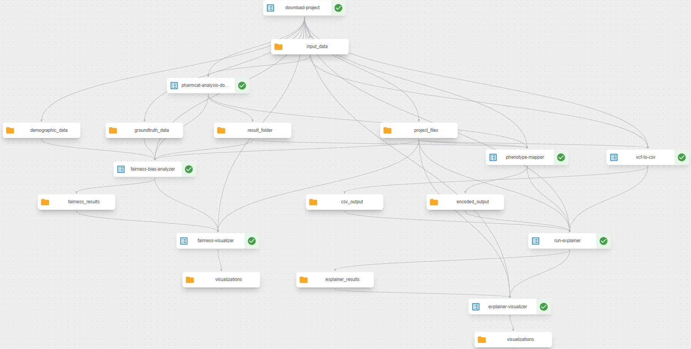

## Pharmacogenomics (PGx) Analysis with Explainability

This project provides tools for analyzing pharmacogenomic phenotype predictions made by PharmCAT and provide explanations regarding its outputs. 
It uses correlation analysis and mutual information techniques to identify which genetic variants contribute to phenotype predictions and includes fairness analysis to detect potential biases across demographic groups.

## Project Overview

PharmCAT is a tool that analyzes genetic data (VCF files) to predict pharmacogenomic phenotypes that influence drug metabolism and response. 
This project adds an explainability layer to understand why PharmCAT makes specific predictions and to identify potential biases.

Key components:
1. Converting VCF genetic data to analyzable CSV format
2. Mapping phenotypes to numeric values for analysis
3. Performing correlation analysis and mutual information analysis to explain PharmCAT predictions
4. Analyzing potential demographic bias and fairness issues in predictions
5. Visualizing results for better interpretation (Optional script provided. Not used in kubeflow pipeline)

The project focuses on the key pharmacogenes: **CYP2B6, CYP2C9, CYP2C19, CYP3A5, SLCO1B1, TPMT, and DPYD.**

## Getting Started

### Prerequisites

- Python 3.10
- Docker (for running PharmCAT)
- Required Python packages (install via `pip install -r requirements.txt`)

### Data Preparation

1. Place your VCF files in the `data/` directory
2. Ensure demographic data is in `Demographics/` (e.g. `pgx_cohort.csv` and `population_codes.md`)
3. Ground truth data should be placed in `Groundtruth/groundtruth_phenotype_filtered.csv`

### Running PharmCAT

Use Docker to run PharmCAT on your VCF files: `docker run -v /path/to/data/:/data -v /path/to/result/:/result pharmcat-realm --input_folder /data --result_folder /result`
This will generate phenotype predictions in the result directory.

### Execution Steps
1. **Download Dataset:** Download the provided dataset.
2. **Download PharmCAT Docker Components:** Download the necessary tools and scripts.
3. **Setup Execution Environment:**
   1. Create a folder called `pharmcat_execution` and unzip all files downloaded from step 2. into it. 
   2. Inside the `data` folder, place all `.vcf` files downloaded from step 1.
4. Navigate inside the `pharmcat_execution` directory and execute: `docker build -t pharmcat-realm .`
5. _(WINDOWS)_ Execute: `docker run -v <absolute_path_to_data_folder>:/data -v <absolute_path_to_result_folder>:/result pharmcat-realm --input_folder /data --result_folder /result`. (e.g. `docker run -v C:/Users/gigak/Desktop/realm_uc2_vito_image/data/:/data -v C:/Users/gigak/Desktop/realm_uc2_vito_image/result/:/result pharmcat-realm --input_folder /data --result_folder /result`).
This will execute the pharmcat pipeline for all samples placed in the `data` folder. The `result` folder will contain `phenotype.json` files for each sample and a total `phenotypes.csv` file containing the output in the format:

| Sample ID | CYP2B6 | CYP2C19 | CYP2C9 | CYP3A5 | DPYD | SLCO1B1 |     TPMT      |
|:---------:|:------:|:-------:|:------:|:------:|:----:|:-------:|:-------------:|
|  HG00276  |   RM   |   NM    |   IM   |   PM   |  NM  |   DF    | INDETERMINATE |
|  HG00436  |   IM   |   NM    |   NM   |   PM   |  NM  |   NF    |      NM       |

6. Place the `result` folder in the root of the current project.
7. Execute `vcf_to_csv.py` to convert all files located in the `data` directory to a csv file. This file will be used in the next steps (e.g. `python vcf_to_csv.py --input_dir data/ --output_csv encoded.csv`)
8. Execute `phenotype_mapper.py` to convert the `result/phenotypes.csv` file to an encoded file that will be used later. (e.g. `python phenotype_mapper.py --input_csv result/phenotypes.csv --output_csv phenotypes_encoded.csv`)
9. Run Explainability Analysis using the `explainer.py` script. (e.g. `python explainer.py --input_file encoded.csv --output_file phenotypes_encoded.csv --results_dir explainer_results --sensitivity 0.7`)
   1. The `sensitivity` parameter (0.0-1.0) controls the analysis method:
      - Lower values (<0.5) use mutual information analysis (faster)
      - Higher values (≥0.5) use correlation analysis (more precise)
10. Fairness and Bias Analysis: `python fairness_bias_analyzer.py --population-codes Demographics/population_codes.md --cohort Demographics/pgx_cohort.csv --phenotypes result/phenotypes.csv --groundtruth Groundtruth/groundtruth_phenotype_filtered.csv --output fairness_analysis.json`
11. Visualize Results (Optional): 
```
# Visualize explainability results
python explainer_visualizer.py --input_file explainer_results/correlation_analysis.json --output_dir explainer_visualizations

# Visualize fairness analysis
python pgx_fairness_visualizer.py --input_file fairness_analysis.json --output_dir fairness_visualizations
```
12. _Alternative Pipeline Execution_: Use the Kubeflow pipeline to automate the entire workflow: `python kubeflow_component/pgx_pipeline_component.py`. This will generate a `pharmcat_pipeline_.yaml` file that can be uploaded to a Kubeflow environment for execution. See more details in the [Kubeflow Pipeline Component](#kubeflow-pipeline-component) section.

## JSON Output

The out of the `explainer.py` script will either be `correlation_analysis.json` or `mutual_information_analysis.json`, depending on sensitivity values:

### Correlation Analysis

The `correlation_analysis.json` file has the following structure:
```json
{
  "Gene": "CYP2B6",
  "Feature": "CYP2C19_rs4244285",
  "Correlation": 0.3380949063896326,
  "P_Value": 0.004201971745583072,
  "Abs_Correlation": 0.3380949063896326
}
```

### Mutual Information Analysis

The `mutual_information_analysis.json` file has the following structure:

```json
{
  "Gene": "CYP2B6",
  "Feature": "CYP2B6_rs3745274",
  "Importance": 0.7626478098149698
}
```

### Fairness Analysis

The `fairness_analysis.json` file produced by `fairness_bias_analyzer.py` has a bit more complex structure and will not be displayed here for brevity.

## Understanding the Results

### Explainability Output

The analysis produces several types of outputs:

1. **Feature Importance**: Identifies which genetic variants most influence phenotype predictions
2. **Correlation/Mutual Information Analysis**: Shows relationships between genetic variants and phenotypes
3. **Visualizations**: Plots showing the relative importance of features for each gene

### Fairness Analysis Output

The fairness analysis produces:

1. **Equalized Odds Metrics**: Measures whether error rates are similar across demographic groups
2. **Demographic Parity Metrics**: Ensures prediction rates are similar across demographic groups
3. **Visualizations**: Plots showing potential disparities in predictions across populations

### Phenotype Classifications and Encoding

The analyzed phenotypes include:
- **PM**: Poor Metabolizer
- **LPM**: Likely Poor Metabolizer
- **IM**: Intermediate Metabolizer
- **LIM**: Likely Intermediate Metabolizer
- **NM**: Normal Metabolizer
- **LNM**: Likely Normal Metabolizer
- **RM**: Rapid Metabolizer
- **LRM**: Likely Rapid Metabolizer
- **UM**: Ultrarapid Metabolizer
- **LUM**: Likely Ultrarapid Metabolizer
- **NF**: Normal Function
- **DF**: Decreased Function
- **PF**: Poor Function
- **PDF**: Possibly Decreased Function
- **IF**: Increased Function
- **INDETERMINATE**: Uncertain phenotype

#### Numeric Encoding of Phenotypes

The `phenotype_mapper.py` script encodes these phenotypes as numeric values for analysis:

| Phenotype     | Encoded Value |
|---------------|---------------|
| NM            | 0             |
| LNM           | 1             |
| IM            | 2             |
| LIM           | 3             |
| PM            | 4             |
| LPM           | 5             |
| UM            | 6             |
| LUM           | 7             |
| RM            | 8             |
| LRM           | 9             |
| NF            | 10            |
| DF            | 11            |
| IF            | 12            |
| PF            | 13            |
| PDF           | 14            |
| INDETERMINATE | -1            |

### Feature Naming Conventions

Features in the output follow these patterns:
- `GENE_rsID`: Basic SNP identifier (e.g., "CYP2B6_rs8192709")
- `GENE_rsID_alt_ALLELE`: Alternative allele (e.g., "DPYD_rs1801160_alt_T")
- `GENE_rsID_ref_ALLELE`: Reference allele (e.g., "CYP2C9_rs28371686_ref_C")
- `GENE_rsID_gt_GENOTYPE`: Genotype (e.g., "CYP2C19_rs3758581_gt_1/1" for homozygous)

## Visualization Outputs (Optional)

The `explainer_visualizer.py` and `pgx_fairness_visualizer.py` scripts generate the following visualizations:

### Explainer Visualizations
- **Top Features per Gene**: Bar charts showing the most important features for each gene based on correlation or mutual information
- **Feature Heatmap**: Displays the relationship between top features and genes to identify patterns
- **Gene-specific Visualizations**: Individual charts for each gene showing feature importance

### Fairness Visualizations
- **Demographic Distribution**: Shows sample distribution across different demographic groups
- **Phenotype Distribution**: Displays phenotype frequencies overall and by superpopulation
- **Equalized Odds Metrics**: Visualizes disparities in true positive and false positive rates across demographic groups
- **Demographic Parity Metrics**: Shows differences in prediction rates across demographic groups
- **Summary Dashboard**: A comprehensive overview of fairness metrics across all genes

## Kubeflow Pipeline Component

The `pgx_pipeline_component.py` file defines a Kubeflow pipeline for automating the pharmacogenomics analysis workflow. This pipeline orchestrates the following components:

1. **Download Component**: Downloads project files, input data, demographic and ground truth data from a specified GitHub repository. The pipeline expects the repo to contain the `Demographics/`, `Groundtruth/` and `data/` folders at its root with all required files placed inside.
2. **PharmCAT Analysis**: Executes the PharmCAT analysis in a Docker container, processing VCF files and generating phenotype predictions. The docker image is built using the provided Dockerfile and all required files and scripts by VITO, and is uploaded to an image hosting repository.
3. **Explainability Analysis**: Applies either correlation analysis or mutual information analysis based on the input sensitivity value, to explain the PharmCAT predictions.
4. **Fairness Analysis**: Evaluates potential bias in the PharmCAT predictions across demographic groups.

**IMPORTANT:** You need to modify the `pharmcat_analysis_docker` function in the `pgx_pipeline_component.py` file to specify your PharmCAT Docker image:

```python
# Replace this:
image="<your_docker_pharmcat_image>",

# With your actual Docker image, for example:
image="docker.io/username/pharmcat-realm:latest",
```

After configuring the Docker image, the pipeline can be compiled and deployed to a Kubeflow environment by executing `python .\kubeflow_component\pgx_pipeline_component.py` and then uploading the generated YAML file to the Kubeflow UI.
The Kubeflow UI expects 2 pipeline arguments when running: `github_repo_url` which contains data and python scripts and `sensitivity`, which is a [0,1] float number.

The pipeline structure can be seen in the image below:


## Accessing the Generated Artifacts

The pipeline stores generated artifacts in MinIO object storage within the Kubeflow namespace. To access these artifacts:
1. Set up port forwarding to the MinIO service by running `kubectl port-forward -n kubeflow svc/minio-service 9000:9000` in a terminal window
2. Access the MinIO web interface at `http://localhost:9000`
3. Log in with the default credentials: **username:** `minio`, **password:** `minio123`
4. Navigate to the `mlpipeline` bucket, where you'll find the respective folders according to the automatically assigned uuid of the pipeline. (An example location could be: `http://localhost:9000/minio/mlpipeline/v2/artifacts/pharmcat-pgx-analysis-pipeline/50c16278-0dde-44f1-b018-5b859a3fadf2/`)

## Execution Steps

1. Download the provided dataset from [here](https://maastrichtuniversity.sharepoint.com/:f:/r/sites/FSE-REALM/Shared%20Documents/WP6/Open_Source_Datasets_per_UC/UC2_PGx2P_VITO/Data/V2?csf=1&web=1&e=1ReQnp).
2. Download the necessary tools and scripts used to create the docker image that takes `.vcf` files and outputs `phenotype.json` and `phenoty.csv` files from [here](https://maastrichtuniversity.sharepoint.com/:u:/r/sites/FSE-REALM/Shared%20Documents/WP6/Open_Source_Datasets_per_UC/UC2_PGx2P_VITO/Data/V2/Software/pharmcat-realm.zip?csf=1&web=1&e=NQFgXx)
3. Create a folder called `pharmcat_execution` and unzip all files downloaded from step 2. into it. 
   1. Inside the `data` folder, place all `.vcf` files downloaded from step 1.
4. Navigate inside the `pharmcat_execution` directory and execute: `docker build -t pharmcat-realm .`
5. _(WINDOWS)_ Execute: `docker run -v <absolute_path_to_data_folder>:/data -v <absolute_path_to_result_folder>:/result pharmcat-realm --input_folder /data --result_folder /result`. (e.g. `docker run -v C:/Users/gigak/Desktop/realm_uc2_vito_image/data/:/data -v C:/Users/gigak/Desktop/realm_uc2_vito_image/result/:/result pharmcat-realm --input_folder /data --result_folder /result`).
This will execute the pharmcat pipeline for all samples placed in the `data` folder. The `result` folder will contain `phenotype.json` files for each sample and a total `phenotypes.csv` file containing the output in the format:

| Sample ID | CYP2B6 | CYP2C19 | CYP2C9 | CYP3A5 | DPYD | SLCO1B1 |     TPMT      |
|:---------:|:------:|:-------:|:------:|:------:|:----:|:-------:|:-------------:|
|  HG00276  |   RM   |   NM    |   IM   |   PM   |  NM  |   DF    | INDETERMINATE |
|  HG00436  |   IM   |   NM    |   NM   |   PM   |  NM  |   NF    |      NM       |

6. Place the `result` folder in the root of the current project.
7.

## 📜 License & Usage

All rights reserved by MetaMinds Innovations.
